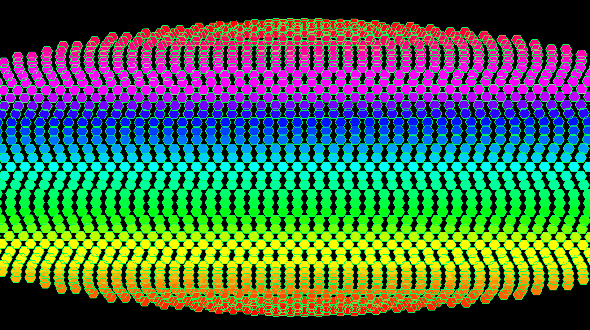
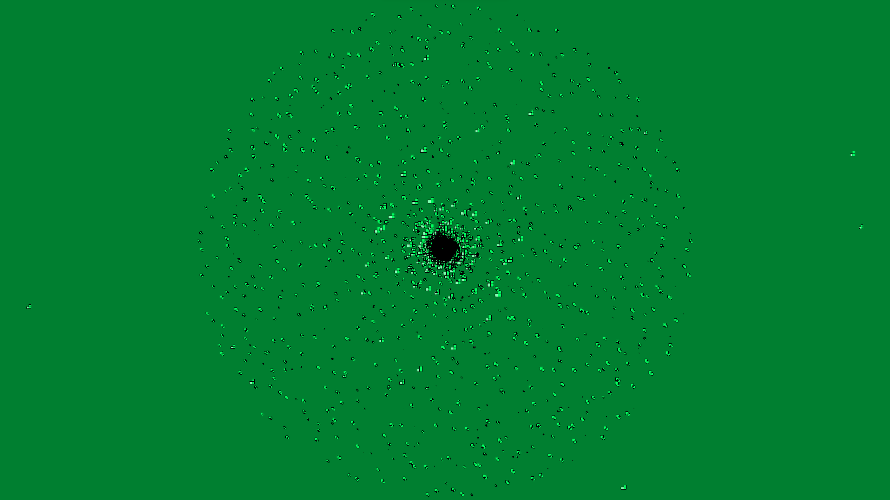
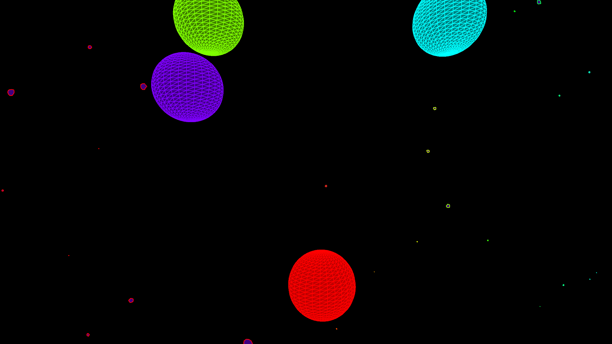
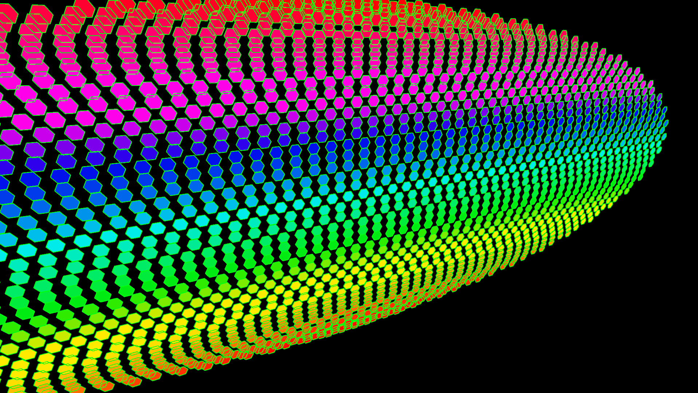
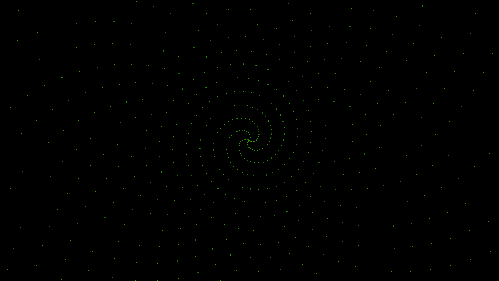
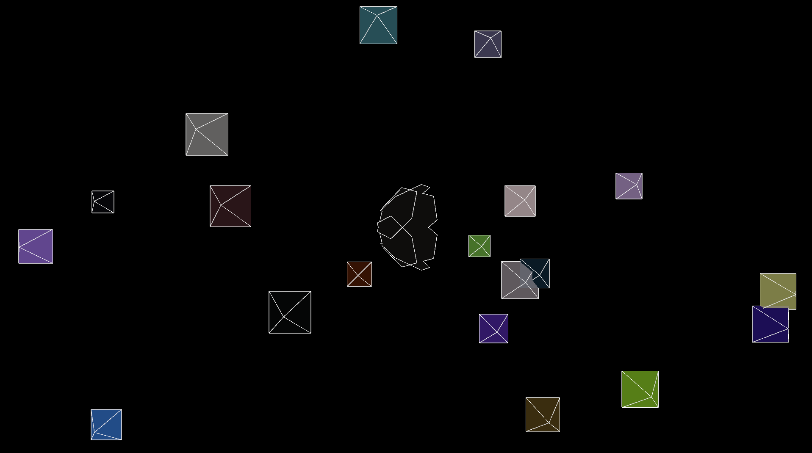
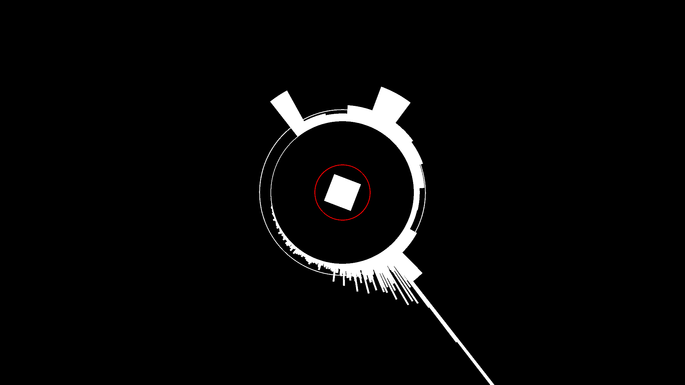

# Music Visualiser Project

| Name | Student Number | Music Visuals |
|-----------|-----------|-----------|
|Kevin Ye | C21421254 |KYVisual1 ,KYVisual2 |
|Evin Saju Melparambil | C21465094 |ESMVisual1, ESMVisual2 |
|Luca Ursache | C21392706 |gambinovisual1 , gambinovisual2 |

# Description of the assignment
## Video
[](https://www.youtube.com/watch?v=GVyOuS_DB-Q)
This is the youtube video of the combined visuals!

## Description
We created a audio music visualiser in Java processing including 6 different visuals. Across all 6 visuals we coded different elements to respond to the volume and frequency of the track “Praise my lord” by ASAP ROCKY.

# Instructions
To run these Music Visuals, you do these following steps:
•	Debug and run the Java file called Main.java.
•	Press 1, 2, 3, 4, 5, 6 keys to run each Music Visuals. 
•	The order of the visuals are: LukaVisual1, LukaVisual2, EvinVisual1, EvinVisual2, KevinVisual1,KevinVisual2.
•	By pressing the 7 key you will exit the program.
# How it works
The way we have configured our music visual project is by creating individual files containing each of our visuals and then having an overall java file called Combined.java to combine the visuals in a efficient and easy way to debug and compile our main file called Main.java.
Under our source folder we have contained each of our two visuals under our student number folders. This distinguishes our visuals apart and make it easier to locate each one. Our source folder contains the ie.tudublin folder, in this folder is where we have our Main.java(This runs our code), the Visual.java(This mainly has imports and using those imports we have created different functions used in our Combined java file), the VisualExceptions.java(This has some functions that extent to the class called throwable and used in our Combined.java) and finally our Combined.java(This contains the code that combines each of our folders together hence combining our Visuals).
We explain our individual visuals further later in the report how we created and the description of each but now we will explain how we combined and ran each individual visual just by clicking the keys I have listed in our instruction section. We combined our folders first by importing each of our visual folders (C21465094, C21421254, 21392706) into the combined java file. Next, we created a class called Combined that extended to the java file Visuals, this takes all the functions and imports we have created and taken in visual to be extended to our file. We then declared each variable but not initializing by calling our visuals and giving them short names such as KYVisual1 as kv1. In our setup we read in our song and prepared it with different functions to be used in our visuals.  We then initialized each of our variables with the visual Exception function. We used keycodes to run each of our visuals. We used the ASCAII keycode system where the value ‘1’ was 49 in ASCAII and so on for 2 ,3, 4 ,5 6, and 7. Finally we used the key pressed function where when each number key is pressed each visual is drawn with the draw function.
# KYVisual1

The code consists of a single class, KYVisual1.
The KYVisual1 class has the following properties:
1.	n1 and n2: Variables to control movement and animation.
2.	kv1: A reference to the main program of type Combined.
The KYVisual1 class has a constructor and a draw method:
1.	Constructor: Takes two arguments: a Combined object and an AudioPlayer object. It initializes the kv1 property with the Combined object passed as a parameter.
2.	draw(): The main drawing loop for the program. It first gets the audio level (amplitude) and sets the color mode to HSB with a range of 360 for hue, 100 for saturation, and 100 for brightness. The method then maps the amplitude to a hue value and sets the background color accordingly.
The method translates the drawing origin to the center of the window. It then iterates through the audio buffer size, calculating angles and positions for the circles and rectangles based on the current frame and audio level. The method draws the circles and rectangles with fill colors based on the amplitude.
Circles are drawn with positions (x, y) and dimensions based on the left channel's audio levels. Rectangles are drawn with positions (x3, y3) and dimensions based on both the left and right channels' audio levels. The variables n1 and n2 are incremented at the end of the loop to create movement and animation in the visualization.
The audio visualization is created by analyzing the audio levels of the left and right channels and mapping them to the size, position, and color of the circles and rectangles. The visualization also includes a dynamic background color based on the audio level, and the shapes' movement creates a more engaging visual effect in response to the audio.

# KYVisual2

This code is a Java program that creates a 2D audio visualization using the Processing library and Minim audio library. The program displays moving asteroids and exploding spheres that react to the audio levels of an audio file. The code consists of two classes, KYVisual2 and Star.
The KYVisual2 class has the following properties:
1.	numStars: An integer representing the number of asteroids that will be displayed.
2.	stars: An array of Star objects.
3.	kv2: A reference to the main program of type Combined.
The KYVisual2 class has a constructor and a draw method:
1.	Constructor: Takes a Combined object as a parameter and initializes the kv2 property. It creates a new Star object for each element of the stars array.
2.	draw(): The main drawing loop for the program. It sets the background to black, centres the display, and draws the asteroids by updating their positions and displaying them. It then draws exploding.
# ESMVisual1

This code is a Java visual that creates a 3D audio visualization using the Processing library. The program displays a rotating oval composed of hexagons that react to the amplitude of an audio file ("Rocky.mp3") known as Praise the Lord by ASAP Rocky. The code consists of a single class, ESMVisual1.
The ESMVisual1 class has several properties:
1.	angle: a variable used to control the rotation of the sphere.
2.	NUM_ROWS: the number of rows of hexagons on the sphere.
3.	HEX_SIZE: the size of the hexagons.
4.	radius: the radius of the oval.
The ESMVisual1 class has three methods:
1.	settings(): Sets the size of the application window and the rendering mode (P3D) for 3D graphics.
2.	setup(): Initializes the program, starting the Minim audio library, loading and playing the audio file, setting the colour mode to HSB, and setting the camera and lighting configurations.
3.	draw(): The main drawing loop for the program. It sets the background color, calculates the average amplitude of the audio, and sets the stroke color based on the smoothed amplitude. The method then pushes a matrix, rotates the sphere, and iterates through the rows and hexagons to draw the hexagonal shapes based on the oval’s geometry. The hexagons are colored based on their vertical position. Finally, the method pops the matrix and updates the angle of rotation.
The audio visual is created by analysing the audio's amplitude and mapping it to the size of the hexagons on the sphere. The calculateAverageAmplitude() method is called to update the average amplitude, and the getSmoothedAmplitude() method is used to access this value. The hexagons are drawn at different sizes depending on the smoothed amplitude, creating a dynamic visual effect in response to the audio.
The 3D sphere is created by calculating the position of each hexagon based on polar coordinates and the number of rows and hexagons. The hexagons are drawn using the hexagon() method, which takes the x, y, and z coordinates, and the size of the hexagon as arguments. The method then draws a hexagon shape by defining vertices and filling it with a color based on its vertical position (y-coordinate).
# ESMVisual2

This code is a Java program that creates a 2D audio visualization using the Processing library and Minim audio library. The program displays ellipses that change size and color based on the audio levels of an audio file ("Rocky.mp3"). The code consists of a single class, ESMVisual2, which extends the Visual class.
The ESMVisual2 class has several properties:
1.	minim: a Minim object for handling audio.
2.	mySound: an AudioPlayer object for playing the audio file.
3.	n, n2, n3, n4, n5, and n6: variables used for controlling motion, rotation, and scaling in the visualization.
4.	speed1 and speed2: variables that control the speed of the motion in the visualization.
The ESMVisual2 class has three methods:
1.	settings(): Sets the size of the application window and the rendering mode (P3D) for 3D graphics.
2.	setup(): Initializes the program, hiding the cursor, setting the background color, frame rate, and color mode. It then loads and plays the audio file using the Minim library.
3.	draw(): The main drawing loop for the program. It sets a semi-transparent black rectangle over the previous frame to create a fading trail effect. The method then translates the drawing origin to the center of the window.
The method iterates through the audio buffer size and calculates the leftLevel, which represents the audio level of the left channel. It maps the frame count to a hue value in the HSB color mode and sets the fill color for the ellipses. It then draws ellipses at positions (i, i) with dimensions based on the leftLevel. The ellipses rotate around the Z-axis based on the value of n. The visualization also includes additional motion by updating n2, n3, and n5, and translating the canvas accordingly.
The audio visualization is created by analyzing the audio levels of the left channel and mapping them to the size and color of the ellipses. The ellipses are drawn at different positions and sizes depending on the audio level, creating a dynamic visual effect in response to the audio. The visualization also includes a fading trail effect and motion to make the visualization more engaging.
# gambinovisual1

This code displays a number of circles that enlarge from the centre according to volume, and lines that protrude outwards reacting to the frequency bands. 
 The code consists of a single class, gambinovisual1, which extends the Visual class.

The gambinovisual1 class has several properties:

mySound: object that manages the playback of the audio file.
player: an additional reference to the AudioPlayer object.
fft: an FFT object used for calculating the Fast Fourier Transform of the audio.
m: a Minim object for managing audio functionality.
x: a variable used to control the rotation of the circle.
radius: the radius of the circle.
The gambinovisual1 class has three methods:

setup(): Initializes the program
settings(): Sets the size of the application window 
draw(): The main drawing loop for the program. It translates the origin to the center of the window, sets the background color, and updates the player and fft objects. It then draws the interior of the circle, which is composed of three rectangles that rotate at different speeds. The circle rotates only while the music is playing. Finally, the method visualizes the audio by drawing lines based on the FFT data and drawing background circles based on the audio's volume.
The audio visualization is created by analyzing the audio's frequency and spectral content using the Fast Fourier Transform (FFT). The fft object is updated with the current audio mix, and the program iterates through the FFT bands and frequencies to draw lines that emanate from the circle. The lengths of these lines depend on the values of the FFT bands and frequencies. Additionally, the program draws background circles that change size based on the audio's volume level.
Pyramid
The visualization displays falling pyramids and a spinning hexagon that implodes into a spiral pattern based on the audio levels of an audio file. The code consists of two classes: gambinovisual1 and Pyramid.

The gambinovisual1 class has the following properties:

gv1: A reference to the main program of type Combined.
hexagonSize: The initial size of the hexagon.
spinSpeed: The speed of the hexagon spin.
numPyramids: The number of pyramids.
pyramids: An array of Pyramid objects.
The gambinovisual1 class has a constructor, draw() method, and keyPressed() method:

Constructor:. It creates new Pyramid objects and stores them in the pyramids array.

draw(): The drawing loop for the program. It sets the background to black, draws falling pyramids by updating their positions and displaying them. It also draws the spinning hexagon that initiates a spiral pattern based on the music's volume level.

keyPressed(): This method is called when a key is pressed. If the spacebar is pressed, it rewinds the sound file to the beginning and plays the sound file.

The Pyramid class has the following properties:

gv1: A reference to the main program.
x, y, z: The x, y, and z coordinates of the pyramid.
baseSize: The size of the pyramid's base.
speed: The speed at which the pyramid falls.
The Pyramid class has a constructor, update() method, and display() method:

Constructor: Initializes the co-ordinates, baseSize, and speed properties.

update(): Updates the y position of the pyramid based on the volume level of the music. If the pyramid goes offscreen, it resets the y position to the top of the screen, randomizes the x position, and randomizes the speed.

display(): Displays the pyramid on the screen. It translates the pyramid to its current position and sets the stroke color to white and fill color to a random RGBA value. It then draws the pyramid using vertices and triangles.

# gambinovisual2


This code displays a number of circles that enlarge from the centre according to volume, and lines that protrude outwards reacting to the frequency bands. 
 The code consists of a single class, gambinovisual2, which extends the Visual class.

The gambinovisual2 class has several properties:

mySound: object that manages the playback of the audio file.
player: an additional reference to the AudioPlayer object.
fft: an FFT object used for calculating the Fast Fourier Transform of the audio.
m: a Minim object for managing audio functionality.
x: a variable used to control the rotation of the circle.
radius: the radius of the circle.
The gambinovisual1 class has three methods:

setup(): Initializes the program
settings(): Sets the size of the application window 
draw(): The main drawing loop for the program. It translates the origin to the center of the window, sets the background color, and updates the player and fft objects. It then draws the interior of the circle, which is composed of three rectangles that rotate at different speeds. The circle rotates only while the music is playing. Finally, the method visualizes the audio by drawing lines based on the FFT data and drawing background circles based on the audio's volume.
The audio visualization is created by analyzing the audio's frequency and spectral content using the Fast Fourier Transform (FFT). The fft object is updated with the current audio mix, and the program iterates through the FFT bands and frequencies to draw lines that emanate from the circle. The lengths of these lines depend on the values of the FFT bands and frequencies. Additionally, the program draws background circles that change size based on the audio's volume level.

# What I am most proud of in the assignment
## Kevin:
I enjoyed figuring out how to create different shapes and make them change according to audio input.
I also enjoyed collaborating with my group to ensure a visually appealing project
## Evin:
I am most proud of how well the project went. Ienjoyed changing values and colours to make a whole different visuals. I also enjoyed adding in different music to see how the visual reacts to the amplititude. Overall it was an amazing project to work on and I will most likely further work on it once I've made my submission as it is such a fun and exciting to do.
## Luca:
I am most proud of the team and our combined effort to make a cool project. 
I also am proud of how many new concepts I learned about in processing while working throughout this project.

This is code:

```Java
public void render()
{
	ui.noFill();
	ui.stroke(255);
	ui.rect(x, y, width, height);
	ui.textAlign(PApplet.CENTER, PApplet.CENTER);
	ui.text(text, x + width * 0.5f, y + height * 0.5f);
}
```

So is this without specifying the language:

```
public void render()
{
	ui.noFill();
	ui.stroke(255);
	ui.rect(x, y, width, height);
	ui.textAlign(PApplet.CENTER, PApplet.CENTER);
	ui.text(text, x + width * 0.5f, y + height * 0.5f);
}
```


